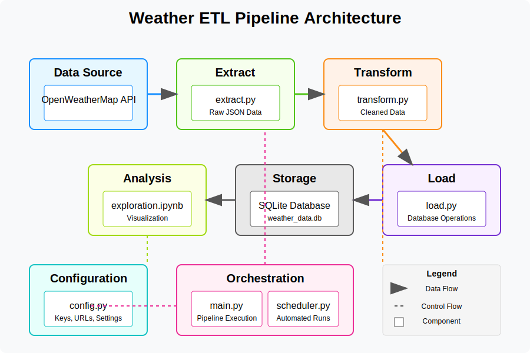

# Weather ETL Pipeline

A complete data engineering project that extracts, transforms, and loads weather data from the OpenWeatherMap API.

## Project Architecture



## Overview

This project implements a complete ETL (Extract, Transform, Load) pipeline for weather data. It collects current weather information from multiple cities via the OpenWeatherMap API, processes the data into a structured format, and stores it in a SQLite database for analysis and visualization.

## Features

- **Data Extraction**: Fetch weather data from OpenWeatherMap API
- **Data Transformation**: Clean and structure raw weather data
- **Data Loading**: Store processed data in SQLite database
- **Data Analysis**: Visualize weather patterns with matplotlib
- **Automated Collection**: Schedule regular data updates

## System Requirements

- Python 3.7+
- Required packages: requests, pandas, matplotlib, sqlalchemy, jupyter, schedule

## Project Structure

```
weather_etl_project/
├── config.py          # Configuration settings
├── extract.py         # Data extraction module
├── transform.py       # Data transformation module
├── load.py            # Database loading module
├── main.py            # Main ETL pipeline orchestration
├── scheduler.py       # Automated scheduling (optional)
├── exploration.ipynb  # Data analysis notebook
├── README.md          # Project documentation
├── project_diagram.svg # Architecture diagram
└── weather_data.db    # SQLite database (generated)
```

## Quick Start

1. **Clone the repository**
   ```bash
   git clone https://github.com/yourusername/weather-etl-pipeline.git
   cd weather-etl-pipeline
   ```

2. **Install dependencies**
   ```bash
   pip install -r requirements.txt
   ```

3. **Configure your API key**
   - Sign up at [OpenWeatherMap](https://openweathermap.org/)
   - Get your API key
   - Update the API_KEY in config.py

4. **Run the pipeline**
   ```bash
   python main.py
   ```

5. **Analyze the data**
   ```bash
   jupyter notebook exploration.ipynb
   ```

## Usage Examples

### Fetch current weather for configured cities
```python
from extract import extract_weather_data

raw_data = extract_weather_data()
print(f"Collected data for {len(raw_data)} cities")
```

### Transform raw data
```python
from transform import transform_weather_data

clean_data = transform_weather_data(raw_data)
print(clean_data[['city_name', 'temp_celsius', 'weather_main']].head())
```

### Run complete pipeline
```python
from main import run_etl_pipeline

result_data = run_etl_pipeline()
```

## Customization

- Add more cities in `config.py`
- Modify transformation logic in `transform.py`
- Create custom visualizations in Jupyter notebook

## Detailed Documentation

For complete details on setup, usage, and customization, see the [full documentation](documentation.md).

## License

[MIT License](LICENSE)

## Acknowledgments

- [OpenWeatherMap](https://openweathermap.org/) for providing the weather API
- [Pandas](https://pandas.pydata.org/) for data processing capabilities
- [SQLite](https://www.sqlite.org/) for database storage
